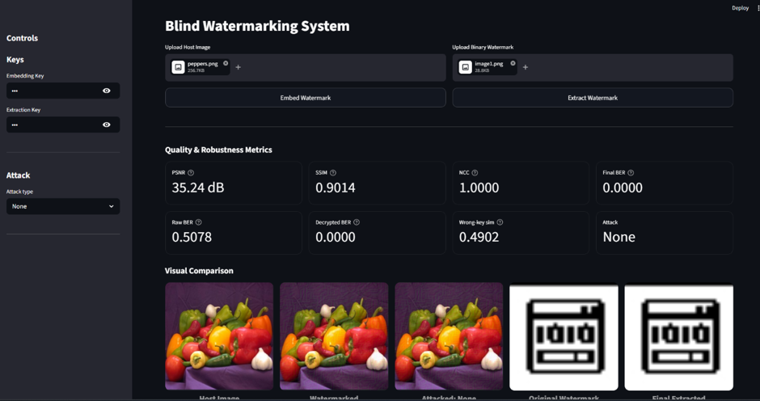
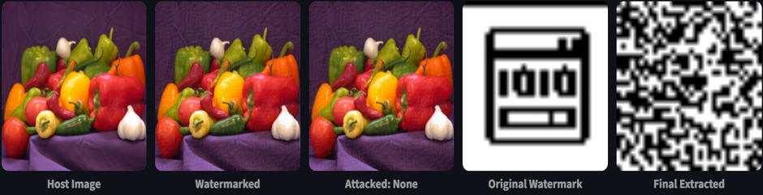

# Deep Learning-Based Secure Blind Image Watermarking

## Overview

This project implements a secure blind image watermarking framework capable of embedding and extracting watermarks without requiring access to the original image during recovery.

The framework combines attention-based watermark embedding, SHA-256 key-conditioned extraction, Error Correction Coding (ECC), and attack-aware training to improve robustness against geometric and signal-processing distortions while maintaining image quality.

The system is designed to achieve a balance between image quality, watermark robustness, and extraction security while operating in a fully blind setting.

---

## Architecture

### Encoder

An attention-based encoder embeds watermark information into the host image while minimizing perceptual distortion.

Components:

* Convolutional feature extraction
* Channel attention
* Spatial attention
* Residual watermark embedding

### Security Module

The watermarking process is conditioned on a SHA-256-derived key tensor.

Security features:

* Key-conditioned watermark encoding
* Error Correction Coding (ECC)
* Unauthorized extraction prevention

### Decoder

A blind decoder extracts watermarks without access to the original image.

A Spatial Transformer Network (STN) is incorporated to improve robustness against:

* Rotation
* Scaling
* Translation
* Cropping

---

## Training Strategy

The model is trained using attack-aware learning.

Training attacks include:

* Gaussian noise
* Salt-and-pepper noise
* JPEG compression
* Blur
* Resize
* Rotation
* Translation
* Cropping

This enables robust watermark recovery under realistic distortions.

---

## Streamlit Application

The project includes an interactive Streamlit interface for watermark embedding, extraction, attack simulation, and metric visualization.

### User Interface

<p align="center">
  
</p>

Features:

* Host image upload
* Watermark upload
* Key-based embedding and extraction
* Attack simulation
* Metric visualization
* Watermark recovery

---

## Results

### Invalid Key Extraction

<p align="center">
  
</p>

Watermark extraction fails when an incorrect key is supplied, demonstrating the effectiveness of the key-conditioned security mechanism.

---

## Experimental Results

### Geometric Attack Robustness

| Host Image | Attack         | NCC    | PSNR (Attacked Image) |
| ---------- | -------------- | ------ | --------------------- |
| Peppers    | Rotation (2°)  | 1.0000 | 20.78 dB              |
| Peppers    | Rotation (5°)  | 0.9989 | 16.52 dB              |
| Peppers    | Rotation (10°) | 0.9799 | 13.86 dB              |
| Peppers    | Rotation (15°) | 0.9742 | 12.54 dB              |
| Dog        | Translation    | 0.9988 | 14.71 dB              |
| Butterfly  | Zoom           | 0.8787 | 13.08 dB              |
| Mountain   | Cropping       | 0.8687 | 15.72 dB              |

### Signal-Processing Attack Robustness

| Host Image | Attack                 | NCC    | PSNR (Attacked Image) |
| ---------- | ---------------------- | ------ | --------------------- |
| Peppers    | Resize                 | 0.9990 | 32.88 dB              |
| Building   | Blur                   | 0.9980 | 23.30 dB              |
| Dog        | Contrast Adjustment    | 1.0000 | 24.12 dB              |
| Butterfly  | Gaussian Noise (0.05%) | 0.9880 | 28.20 dB              |
| Building   | JPEG Compression       | 0.9600 | 27.50 dB              |
| Mountain   | Salt & Pepper Noise    | 0.9800 | 21.32 dB              |

### Watermarked Image Quality

| Host Image | PSNR     |
| ---------- | -------- |
| Peppers    | 37.0 dB  |
| Building   | 36.0 dB  |
| Dog        | 34.2 dB  |
| Butterfly  | 35.6 dB  |
| Mountain   | 39.23 dB |

The experimental results demonstrate reliable watermark recovery under both geometric and signal-processing attacks while maintaining high visual quality of the watermarked image.

---

## Evaluation Metrics

### Image Quality

* PSNR (Peak Signal-to-Noise Ratio)
* SSIM (Structural Similarity Index)

### Watermark Recovery

* NCC (Normalized Cross-Correlation)
* BER (Bit Error Rate)

---

## Running the Project

### Install Dependencies

```bash
pip install -r requirements.txt
```

### Train

```bash
python train.py
```

### Evaluate

```bash
python test.py
```

### Launch Streamlit Application

```bash
streamlit run app.py
```
